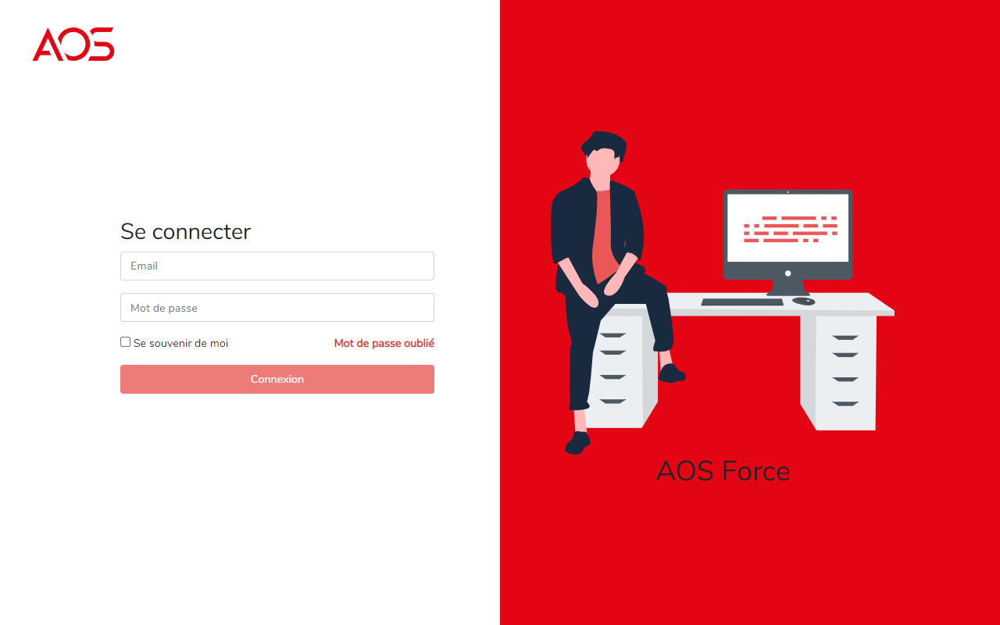
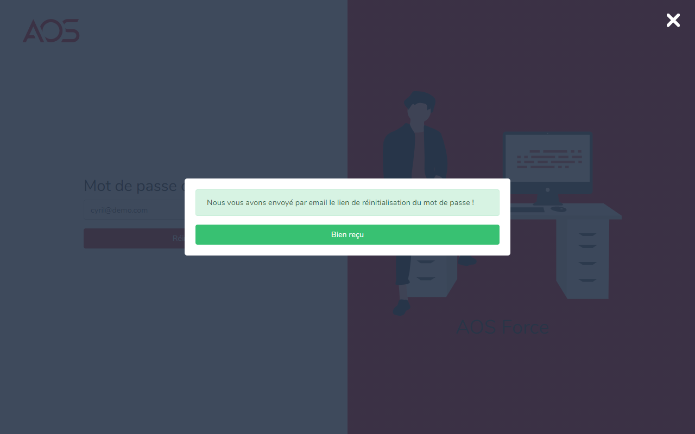
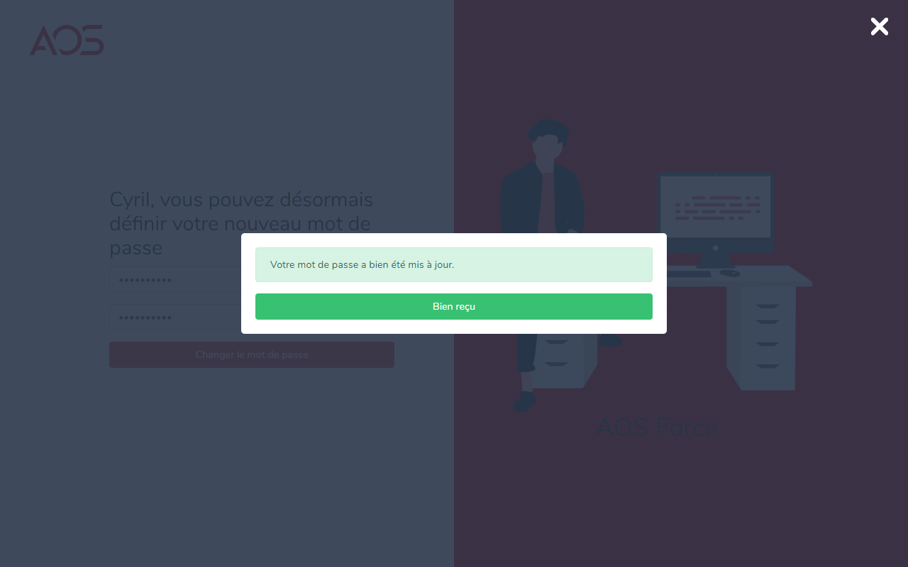
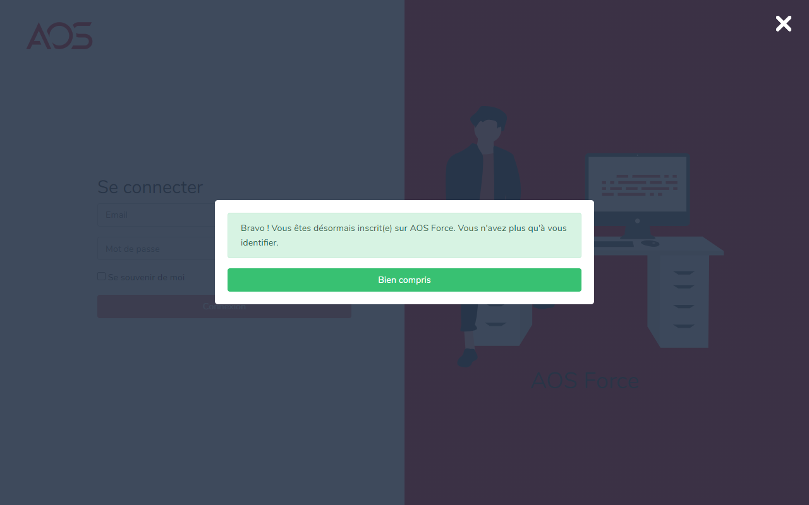
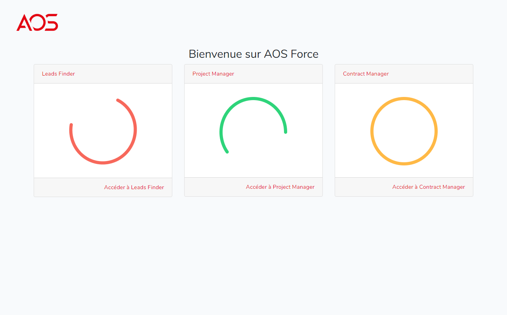

# AOS Force - Authentication module

## Introduction
AOS Force is the ERP of AOS company.

The goal is to provide AOS with a single tool to centralize all day-to-day operations for sales, training, support, etc.

The technology used is PHP (Laravel 6 LTS) and React for the front.

#

## Central authentication
This module allows you to identify yourself on the aosforce.com sub domains.

At the time of identification, a Bearer Token is generated for the user. This token has a validitity of 3600 seconds and is also saved as a cookie in the browser.
This cookie is associated in "wildcard" defined as "* .aosforce.com"

The cookie is generated with the JWT-Auth library : https://jwt-auth.readthedocs.io/en/develop/quick-start/

#

## How to install it and try it

First of all, it is recommanded to use Laravel Valet to simulate the real behaviour.
With Laravel valet, you need to specific a wildcard domain with the following command : 
```
valet tld local.test
```
Then, access to your application with https://authentication.local.test/.
If your browser refuses the HTTPS connection, launch the following command:
``` 
valet secure
``` 

If Nginx returns a "404 - Valet not found", open a terminal in the `this-repository/apps/` and launch the following command:
``` 
valet park
``` 
It will define the repository as "root directory" for Laravel Valet.

You need to follow the instructions here : https://jwt-auth.readthedocs.io/en/develop/laravel-installation/
Inside the config/auth.php file you will need to make a few changes to configure Laravel to use the jwt guard to power your application authentication.

Make the following changes to the file:
```
'defaults' => [
    'guard' => 'api',
    'passwords' => 'users',
],

...

'guards' => [
    'api' => [
        'driver' => 'jwt',
        'provider' => 'users',
    ],
],
```

Then, edit the `.env` file and add the following constants:
```
# Security for cookies
SESSION_SECURE_COOKIE=true

# Define the wildcard
APP_SUB_DOMAIN=local.test

# Set a secret or start: php artisan jwt:token
JWT_SECRET=c0Jby5CwrVJTDoBVYz2sAbP3IEAcXZiDGBbwN1IqaQs04NEf5pYI9nBlCN7YKmSx


# Then define the MongoDB parameters.
DB_CONNECTION=mongodb
DB_DSN=mongodb://localhost:27017
DB_DATABASE=contract_manager
APP_SUB_DOMAIN=local.test
```


Then, create a app/User.php by using the following structure:
```php
<?php
use Illuminate\Support\Str;
use AOSForceMonoRepo\Authentication\Models\User as AOSForceUser;
/**
 * Class User
 *
 * @mixin Builder
 *
 * @package App
 */
class User extends AOSForceUser
{
    /// Your code...
}
?>
``` 

In the app/Http/Kernel.php file, use the `UserIsAuthenticated` middleware if the route called must be accessible only for users already connected:
```php
<?php
// The Kernel file...
'your-middleware-alias' => [
    \AOSForceMonoRepo\Authentication\Middleware\UserIsAuthenticated::class
]
>
```

Finally, just start the `composer u`, even if you already started `composer i`.

Enjoy :-)

## Screenshots









